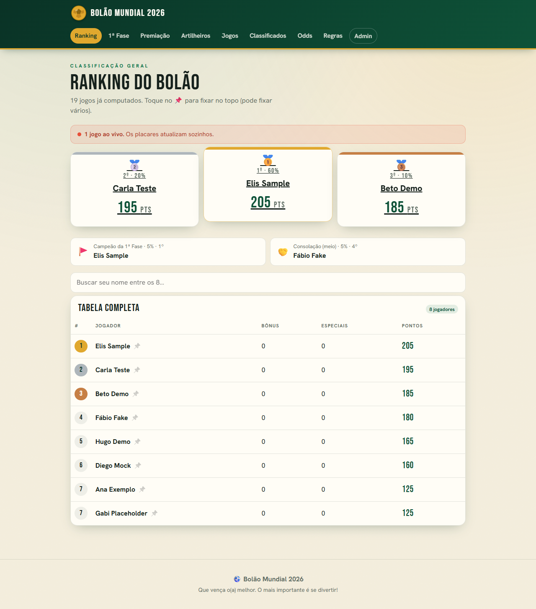
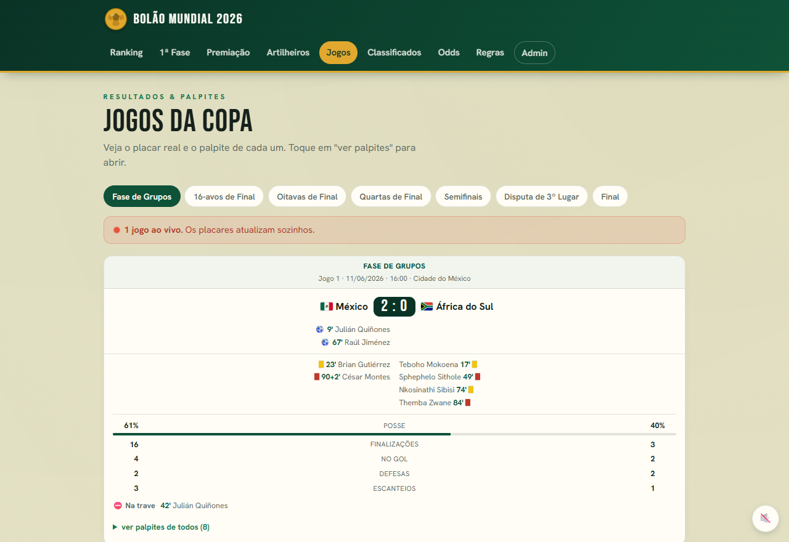
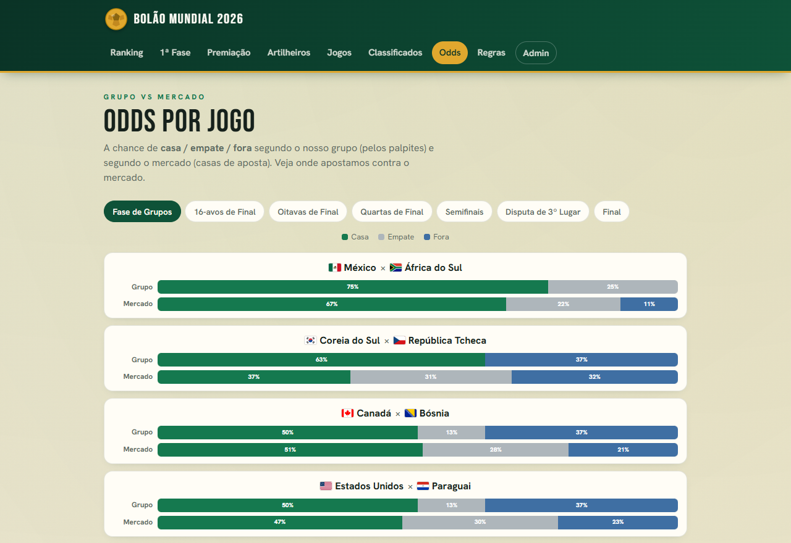
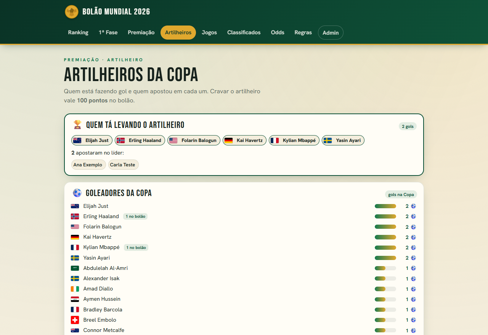
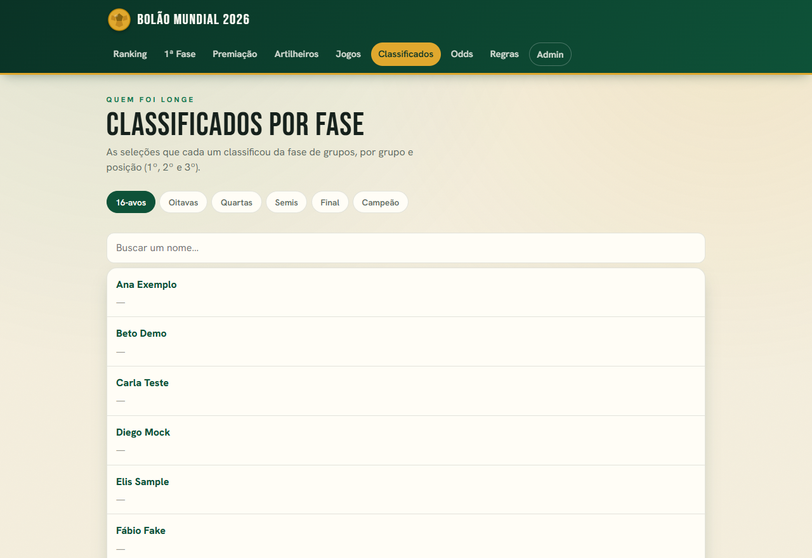
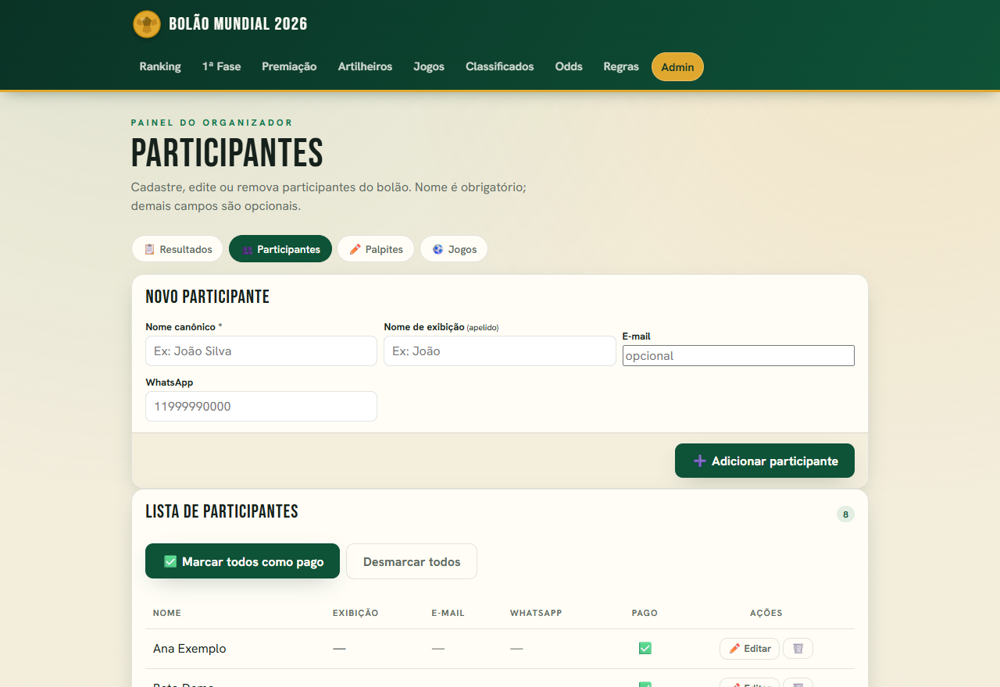
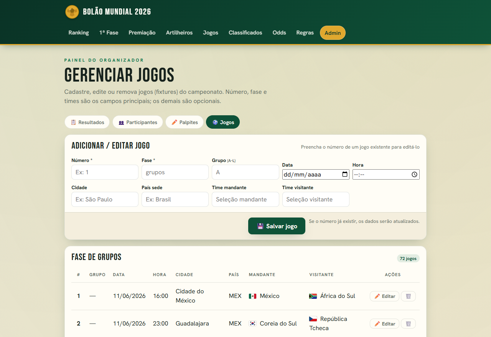

# Bolão Mundial 2026

[](LICENSE)
[](https://nodejs.org)

Aplicação web completa para gerenciar um bolão da Copa do Mundo 2026. Ranking automático, placar ao vivo, gráfico de evolução e painel admin — tudo sem planilha e sem serviços pagos.

Código aberto, licença MIT, mantido pela organização **LDM**.
Repositório: `github.com/ldm-tech/bolao-mundial-2026`

---

## Por que estudar este projeto?

- **Dados ao vivo direto da ESPN** sem chave de API paga — o placar, o minuto, os autores dos gols, os cartões, as estatísticas e as bolas na trave chegam da API pública da ESPN via polling a cada 60 s.
- **Gráfico SVG desenhado à mão** — sem Chart.js nem D3: o `public/evolucao.js` constrói o SVG no cliente com coordenadas calculadas em JavaScript puro.
- **Motor de pontuação puro e testável** — `src/scoring.js` expõe funções sem efeito colateral que o `node:test` cobre em todos os casos de borda.
- **"Quem secar"** — durante um jogo ao vivo, o app calcula em tempo real quem ainda tem chance de cravar o placar exato.
- **Admin independente de planilha** — CRUD completo de participantes, palpites e jogos pela interface web; a importação de planilha `.xlsx` é opcional.

---

## Funcionalidades

| Tela | Descrição |
|---|---|
| `/` | Redireciona para o jogo ao vivo ativo; caso contrário, exibe o ranking |
| `/ranking` | Ranking geral com pódio e premiação parcial |
| `/fase-grupos` | Ranking restrito à fase de grupos |
| `/jogos` | Todos os jogos da fase selecionada com palpites, pontos e detalhes ao vivo |
| `/artilheiros` | Artilheiros da Copa (consolidados dos dados da ESPN) |
| `/classificados` | Seleções classificadas por fase do mata-mata |
| `/odds` | Odds do bolão vs. odds de mercado (ESPN) |
| `/premiacao` | Premiação configurável com valor parcial atual |
| `/regulamento` | Regras e tabela de pontos |
| `/jogador/:id` | Pontuação detalhada de um participante, fase a fase |
| `/admin` | Painel administrativo (protegido por senha) |

### Jogos ao vivo

A tela `/jogos` exibe, para cada partida em andamento:

- Minuto corrente e acréscimos
- Autores e minuto de cada gol (com gols contra e pênaltis identificados)
- Cartões amarelos e vermelhos (incluindo segundo amarelo)
- Estatísticas: posse de bola, chutes, chutes no gol, defesas, escanteios
- Bolas na trave/travessão
- **"Quem secar"**: lista de quem está cravando o placar exato agora e quem ainda pode cravar

### Gráfico de evolução

No ranking é possível fixar ("pinar") participantes e ver o gráfico de pontuação acumulada jogo a jogo, com tooltip interativo ao passar o cursor.

### Premiação

Configurada em `data/premiacao.json`: valor da aposta por participante, percentuais de cada prêmio e as posições contempladas (1º, 2º, 3º lugar geral, campeão da fase de grupos, "consolação do meio da tabela").

### Tabela de pontuação

| Acerto | Pontos |
|---|---|
| Placar exato | 35 |
| Vencedor/empate + gols de uma equipe | 20 |
| Vencedor/empate sem acertar gols | 10 |
| Só o número de gols de uma equipe | 5 |
| Confronto / seleção certa — 1/16 | 30 / 15 |
| Confronto / seleção certa — Oitavas | 50 / 25 |
| Confronto / seleção certa — Quartas | 75 / 35 |
| Confronto / seleção certa — Semis | 100 / 50 |
| Artilheiro da Copa | 100 |
| Os dois finalistas | 200 |
| Campeão | 500 |

---

## Como rodar

### Com Docker (recomendado)

```bash
docker compose up
```

Acesse em [http://localhost:3000](http://localhost:3000).

Na primeira execução o seed popula automaticamente jogadores, palpites e alguns resultados de exemplo (dados **fictícios**).

Para rodar em segundo plano:

```bash
docker compose up -d
```

O banco SQLite fica em `./data/bolao.db`, persistido pelo volume do Docker entre reinícios.

### Sem Docker (local)

**Pré-requisito:** Node.js 20 ou superior (recomendado: 22).

```bash
npm install
npm start        # popula o banco (se vazio) e sobe o servidor em http://localhost:3000
```

> `npm start` já roda o seed automaticamente. Para apenas subir o servidor sem
> popular, use `npm run serve`.

Para definir a senha do admin antes do seed:

```bash
# Linux/macOS
BOLAO_ADMIN_SENHA="suaSenhaForte" npm run seed

# Windows PowerShell
$env:BOLAO_ADMIN_SENHA="suaSenhaForte"; npm run seed
```

Se a variável não for definida, o seed gera uma senha aleatória e a imprime no console.

### Scripts disponíveis

| Comando | O que faz |
|---|---|
| `npm start` | Popula o banco (se necessário) e inicia o servidor |
| `npm run serve` | Apenas inicia o servidor (`node src/server.js`), sem seed |
| `npm run seed` | Popula o banco com os dados de exemplo (`node scripts/seed.js`) |
| `npm test` | Executa a suíte de testes (`node --test`) |

---

## Configuração

Copie `.env.example` para `.env` e ajuste os valores:

```bash
cp .env.example .env
```

| Variável | Descrição | Padrão |
|---|---|---|
| `PORT` | Porta do servidor | `3000` |
| `BOLAO_DB` | Caminho do arquivo SQLite | `/data/bolao.db` |
| `BOLAO_ADMIN_SENHA` | Senha do painel `/admin` (usada apenas no seed inicial) | gera aleatória |
| `BOLAO_SESSION_SECRET` | Segredo do cookie de sessão | aleatório por boot |

> Em produção, **defina `BOLAO_SESSION_SECRET`** com um hex aleatório fixo; caso contrário, todos os logins de admin caem a cada reinício do servidor.
>
> Gere um segredo: `node -e "console.log(require('crypto').randomBytes(32).toString('hex'))"`

---

## Painel Admin

Acesse `/admin` e informe a senha definida em `BOLAO_ADMIN_SENHA` (ou a gerada pelo seed).

O painel permite:

- **Resultados**: lançar placares jogo a jogo, por fase (grupos, 16-avos, oitavas, quartas, semifinais, 3º lugar e final), além de artilheiro e campeão da Copa.
- **Participantes**: criar, editar e remover participantes; marcar quem pagou.
- **Palpites**: lançar ou corrigir os palpites de qualquer participante para qualquer jogo.
- **Jogos**: adicionar, editar ou remover jogos do fixture.

### Importação opcional por planilha

É possível importar palpites em lote a partir de um arquivo `.xlsx`. Veja o modelo em `exemplo/palpites-modelo.xlsx` e as instruções completas em [`exemplo/README.md`](exemplo/README.md).

```bash
node scripts/import-planilha.js caminho/da/planilha.xlsx
```

A importação é totalmente opcional; o admin pode lançar tudo pela interface.

---

## Fonte de dados ao vivo

Placar, minuto, autores dos gols, cartões, estatísticas e bolas na trave vêm da **API pública da ESPN** — gratuita, sem cadastro nem token:

- Scoreboard: `https://site.api.espn.com/apis/site/v2/sports/soccer/fifa.world/scoreboard`
- Summary (por evento): `https://site.api.espn.com/apis/site/v2/sports/soccer/fifa.world/summary?event=<id>`

O agendador de detalhes ao vivo roda a cada 60 s. O agendador de odds de mercado roda a cada 6 h. Ambos são iniciados automaticamente junto com o servidor.

---

## Estrutura de pastas

```
bolao-mundial-2026/
├── src/                  # Código do servidor (Node/Express)
│   ├── server.js         # Rotas e inicialização do app
│   ├── ranking.js        # Motor de ranking (passe único, cache)
│   ├── scoring.js        # Motor de pontuação (funções puras)
│   ├── detalhevivo.js    # Dados ao vivo da ESPN (placar, autores, cartões...)
│   ├── odds.js           # Odds do bolão e do mercado (ESPN)
│   ├── secador.js        # "Quem secar" — quem pode cravar o placar exato
│   ├── premiacao.js      # Cálculo de premiação a partir do data/premiacao.json
│   ├── artilheiros.js    # Consolidação dos artilheiros
│   ├── classificados.js  # Seleções classificadas por fase
│   ├── participantes.js  # CRUD de participantes
│   ├── palpites-admin.js # Leitura/escrita de palpites pelo admin
│   ├── jogos-admin.js    # CRUD de jogos pelo admin
│   ├── db.js             # Conexão e migração do banco SQLite
│   ├── auth.js           # Hash e verificação de senha
│   ├── flags.js          # Mapeamento de seleções para bandeiras
│   ├── jogadores-fut.js  # Normalização de nomes de jogadores
│   └── views/            # Templates EJS
├── public/               # Arquivos estáticos
│   ├── evolucao.js       # Gráfico SVG de evolução (sem dependências)
│   ├── auto-refresh.js   # Polling de auto-atualização do ranking
│   ├── ranking-busca.js  # Busca de participantes no ranking
│   ├── relogio-vivo.js   # Relógio do minuto corrente (ao vivo)
│   └── styles.css        # Estilos do site
├── data/
│   ├── seed-exemplo.json # Participantes, palpites e resultados fictícios
│   ├── premiacao.json    # Configuração de premiação
│   └── fixture-base.json # Os 104 jogos da Copa 2026
├── scripts/
│   ├── seed.js           # Popula o banco a partir do seed-exemplo.json
│   ├── import-planilha.js# Importação opcional de palpites via .xlsx
│   └── gera-modelo.js    # Gera o modelo de planilha de importação
├── exemplo/
│   ├── README.md         # Instruções de importação por planilha
│   └── palpites-modelo.xlsx
├── test/                 # Suíte de testes (node:test)
├── Dockerfile
├── docker-compose.yml
└── .env.example
```

---

## Testes

```bash
npm test
```

Executa `node --test` sobre todos os arquivos em `test/`. A suíte cobre o motor de pontuação, ranking, premiação, detalhes ao vivo, odds, "quem secar", importação de planilha, seed e outros módulos.

---

## Premiação

Configure em `data/premiacao.json`:

```json
{
  "valorAposta": 0,
  "distribuicao": [
    { "chave": "primeiro",     "rotulo": "1º Lugar",           "fonte": "geral",      "posicao": 1, "pct": 0.60 },
    { "chave": "segundo",      "rotulo": "2º Lugar",           "fonte": "geral",      "posicao": 2, "pct": 0.20 },
    { "chave": "terceiro",     "rotulo": "3º Lugar",           "fonte": "geral",      "posicao": 3, "pct": 0.10 },
    { "chave": "primeiraFase", "rotulo": "Campeão da 1ª Fase", "fonte": "faseGrupos", "posicao": 1, "pct": 0.05 },
    { "chave": "meio",         "rotulo": "Consolação (meio)",  "fonte": "meio",       "posicao": null, "pct": 0.05 }
  ]
}
```

Ajuste `valorAposta` (R$ por participante) e os percentuais conforme o seu bolão. A posição "meio" é calculada automaticamente como o teto de `N/2` participantes.

---

## Dados de exemplo

Os dados que vêm no projeto (`data/seed-exemplo.json`) são **completamente fictícios** — nomes, palpites e resultados foram gerados apenas para demonstrar o funcionamento da aplicação. Substitua pelo seed real do seu bolão antes de usar em produção.

---

## Capturas de tela

> As imagens abaixo usam os **dados de exemplo** que já vêm no projeto (participantes fictícios).

### Ranking
Pódio, classificação completa e gráfico de evolução.



### Jogos
Placar ao vivo, autores dos gols, cartões, estatísticas e "quem secar".



### Odds por jogo
Probabilidades segundo o grupo (palpites) e segundo o mercado (ESPN).



### Artilheiros


### Classificados


### Admin — Participantes e Jogos
Cadastro de participantes, palpites e jogos, independente de planilha.





---

## Contribuindo

Leia [CONTRIBUTING.md](CONTRIBUTING.md) para saber como configurar o ambiente, rodar os testes e abrir um pull request.

---

## Licença

MIT — veja [LICENSE](LICENSE).
